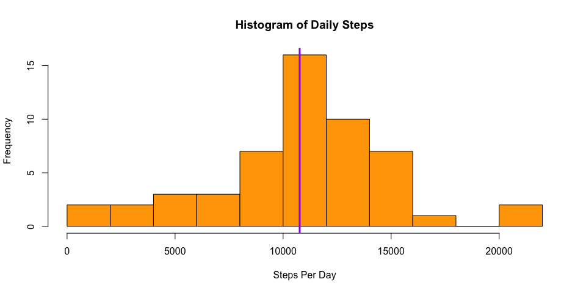

# Reproducible Research: Peer Assessment 1
Seth Waldecker  

## Load packages and set options

```r
library(ggplot2)

# the scipen option is to avoid representing numbers in scientific notation
# the digits option is to include only one decimal place in real numbers. 
options("scipen" = 999, digits = 1)
```

## Loading and preprocessing the data
The columns in the file containing the data for this project are comma delimited, and the first line of the file contains the names of columns. This arrangement corresponds with the defaults in the 'read.csv' function, so only the file name is needed as input for this function. 

Each column was checked for NA values, and only the "steps" column was found to contain NA values. The results of this check can be seen below. To begin the analysis of the data, a new data frame was made with the NA values removed. The code for this intitial exploration and pre-processing is shown below. The first 6 rows of the data frame is also shown below. 


```r
# read in the data file
raw_df <- read.csv("activity.csv")

# check for NA values in each column
apply(raw_df, 2, function(x) any(is.na(x)))
```

```
##    steps     date interval 
##     TRUE    FALSE    FALSE
```

```r
# remove NA values
mod_df <- raw_df[complete.cases(raw_df), ]

# first 6 rows of the data frame with the NA values removed
head( mod_df )
```

```
##     steps       date interval
## 289     0 2012-10-02        0
## 290     0 2012-10-02        5
## 291     0 2012-10-02       10
## 292     0 2012-10-02       15
## 293     0 2012-10-02       20
## 294     0 2012-10-02       25
```


## What is mean total number of steps taken per day?
The total number of steps per day was calculated by summing over the steps column grouped by date. The mean and median were then extracted from the new steps column. The code is shown below. 


```r
# sum the steps by date
day_df <- aggregate( steps ~ date, mod_df, FUN = sum)
mean_rate <- mean( day_df$steps )
median_rate <- median( day_df$steps )
```
The mean steps per day is 10766.2 steps and the median is 10765 steps. Figure 1 shows a histogram of the steps per day, and a vertical line is drawn at the location of the mean. 


```r
# make a histogram
hist(day_df$steps, breaks = 10, xlab = "Steps Per Day", col = "orange",
     main = "Histogram of Daily Steps")

# add vertical line to show the average. 
abline( v = mean_rate, col = "purple", lwd = 3)
```




## What is the average daily activity pattern?
The average daily activity pattern was obtained by calculating the average number of steps grouped by interval. Figure 2 below shows the resulting averaged time series. One can see from the figure that the peak activity occurs around 8:30 AM. This period of activity could be a result of the morning rush to get to work. Alternatively, perhaps the person often goes for a brief run or jog in the morning.

There are smaller, but still prominent, peaks occurring around 12:00 PM, 3:45 PM, and 6:45 PM. These could correspond with lunch break, leaving for work, and dinner time, respectively. Based on the graph, I guess the person typically goes to bed sometime between 10:00 PM and 11:00 PM. 


```r
interval_df <- mod_df
interval_df$interval <- as.factor(interval_df$interval) 

# calculate the average steps grouped by interval
interval_avg_df <- aggregate( steps ~ interval, interval_df, mean)
interval_avg_df$interval <- as.numeric(as.character(interval_avg_df$interval))
```


```r
# make a time series plot
with( interval_avg_df, plot(interval, steps, xlab = "Military Time", ylab = "Steps",
                        main = "Average Number of Steps Per Five-Minute Interval",
                        col = "blue", type = "l", lty = 1, axes = FALSE ))

# x-axis setup
xmajor_ticks = seq( 0, 2400, by = 200 )
xminor_ticks = seq( 100, 2300, by = 200 )
times = as.character(seq(0, 24, by = 2))
xlabels = sapply( times, function(x) paste(x, ":00", sep = ""))
axis(1, at = xmajor_ticks, labels = xlabels)
rug( x = xminor_ticks, ticksize = -0.015, side = 1)

# y-axis setup
ymajor_ticks = seq( 0, 200, by = 50 )
yminor_ticks = seq( 50, 150, by = 50 )
axis(2, at = ymajor_ticks)
rug( x = yminor_ticks, ticksize = -0.015, side = 2)
```


```r
# max_steps is the maximum average steps per 5-minute interval
# max_interval is the interval that corresponds to max_steps
max_steps <- max( interval_avg_df$steps )
max_interval <- interval_avg_df[interval_avg_df$steps == max_steps, 'interval']
```

On average the maximum number of steps occurs in the interval beginning at 835, corresponding to a value of 206.2 steps. These numbers relate well to the time series in Fig. 2. Interpreting the values of the intervals as military time, the most active interval occurs between 8:35 AM and 8:40 AM.   

## Imputing missing values
Let's first take a look at the data with missing values. Of particular interest is wether the missing values occur for the entirety of a day or only part of a day. A quick way to check this is to sum up the values of all the intervals for each date. If the entirety of the day is missing, the sum should add up to 339,120. This is indeed the case, as can be seen in the output below. This knowledge will facilitate the imputation.  


```r
missing_df <- raw_df[ is.na(raw_df$steps), ]
missing_sum_df <- aggregate(interval ~ date, missing_df, sum)

# output
missing_sum_df
```

```
##         date interval
## 1 2012-10-01   339120
## 2 2012-10-08   339120
## 3 2012-11-01   339120
## 4 2012-11-04   339120
## 5 2012-11-09   339120
## 6 2012-11-10   339120
## 7 2012-11-14   339120
## 8 2012-11-30   339120
```

The strategy used for imputation was to calculate the average number of steps per five-minute interval for each day of the week (e.g. "Monday", "Tuesday"). The average distribution was then imputed to the missing values according to what day of the week the data was not collected. The code for performing this imputation is shown below. 


```r
# calculate the 5-minute interval average for each day of the week, 
# then impute missing values for a given day of the week with the 
# corresponding average.

# create a new column showing the day of the week that corresponds with 
# given date. 
date_vec <- as.Date(interval_df$date, format = "%Y-%m-%d")
interval_df["day"] <- as.factor(weekdays(date_vec))

# calculate the distribution of average values by day. 
days_df <- aggregate( steps ~ interval + day, interval_df, mean )
head(days_df, 10)
```

```
##    interval    day steps
## 1         0 Friday     0
## 2         5 Friday     0
## 3        10 Friday     0
## 4        15 Friday     0
## 5        20 Friday     0
## 6        25 Friday     0
## 7        30 Friday     0
## 8        35 Friday     0
## 9        40 Friday     0
## 10       45 Friday     0
```

```r
imputed_df <- raw_df
date_vec <- as.Date(imputed_df$date, format = "%Y-%m-%d")
imputed_df["day"] <- as.factor(weekdays(date_vec))

# find the days of the week for which missing values occur. 
days <- unique(imputed_df[is.na(imputed_df$steps),]$day)

print(days)
```

```
## [1] Monday    Thursday  Sunday    Friday    Saturday  Wednesday
## Levels: Friday Monday Saturday Sunday Thursday Tuesday Wednesday
```

```r
# THE IMPUTATION
# use is made of the fact that for a date in which missing values occur, 
# the missing values occur for each interval corresponding to that date. 
for( day in days ) {
    imputed_df[(is.na(imputed_df$steps)) & (imputed_df$day == day), ]$steps <-   
        days_df[days_df$day == day, ]$steps
}
    
# find the new mean and median
day_df2 <- aggregate( steps ~ date, imputed_df, FUN = sum)
mean_rate <- mean( day_df2$steps )
median_rate <- median( day_df2$steps )
```

The new mean is 10821.2 steps and the new median is 11015 steps. These numbers are slightly higher than the calculation with the missing values removed. In Fig. 3, a new histogram (the one with a blue border) is laid over the original one to highlight the changes. Including the imputed values increases the number of days in which the average number of steps is between 8,000 and 14,000 steps. The range that increases the most is the one from 12,000 to 14,000 steps. 


```r
# histogram without imputed values
hist(day_df$steps, breaks = 10, ylim = c(0, 20), xlab = "Steps Per Day", 
     col = "orange", main = "Histogram of Daily Steps")

# histogram with imputed values
hist(day_df2$steps, breaks = 10, border = "blue", add = T)
legend("topright", c("NA removed", "NA imputed"), col = c("orange", "blue"), lwd = 10)
box()
```


## Are there differences in activity patterns between weekdays and weekends?
Figure 4 shows the activity patterns for weekdays (Monday - Friday) and weekends(Saturday-Sunday). The weekday panel has a similar pattern to the overall average pattern seen in Fig. 2. Comparing the two panels, it is evident that on weekends there is less activity in the morning but more activity in the afternoon. In addition, the person gets up later on the weekends but seems to go to bed earlier. 

```r
# function to determine wether a day is a weekday or a weekend
day_type_f <- function( day ) {
    
    weekday <- c("Monday", "Tuesday", "Wednesday", "Thursday", "Friday")
    weekend <- c("Saturday", "Sunday")
    
    if( day %in% weekday ) { day_type <- "weekday" }
    else if( day %in% weekend ) { day_type <- "weekend" }
    else { print(paste("Day =", day))
           stop("Invalid Day") 
    }
    
    day_type
}

imputed_df["day.type"] <- as.factor(sapply(imputed_df$day, day_type_f))
imputed_df$interval <- as.factor(imputed_df$interval) 
imputed_avg_df <- aggregate( steps ~ interval + day.type, imputed_df, mean)
imputed_avg_df$interval <- as.numeric(as.character(imputed_avg_df$interval))
```


```r
# make a plot comparing activity pattern for weekdays and weekends
ggplot(data = imputed_avg_df, aes( x = interval, y = steps ) ) +
           geom_line() + facet_grid( day.type ~ . ) +
           ggtitle( "Average Daily Steps Per Five-Minute Interval" ) +
           labs(x = "Military Time", y = "Average Steps")
```


